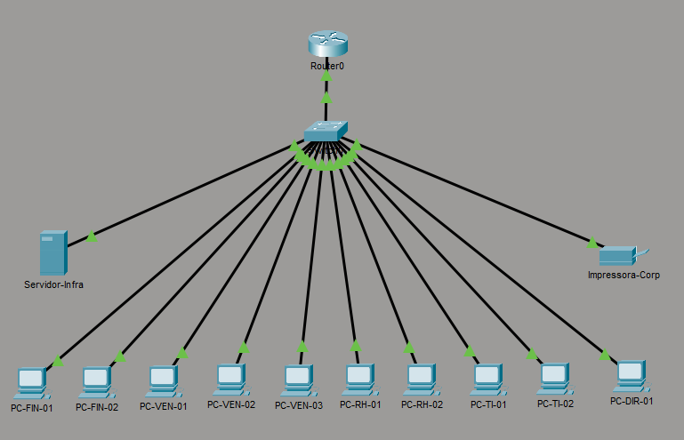
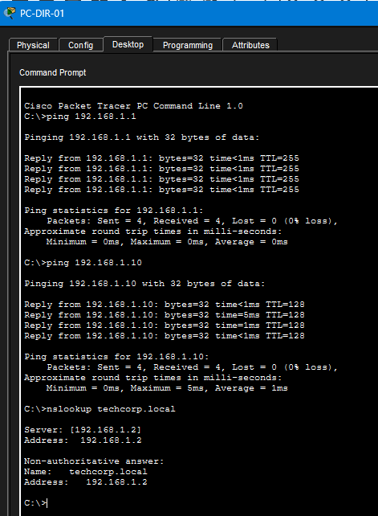

# 🌐 Projeto 01: Infraestrutura de Rede Local Corporativa (LAN)

Este projeto consiste na implementação e simulação de uma pequena infraestrutura de rede local para uma pequena empresa fictícia (*TechCorp*), utilizando o Cisco Packet Tracer.

---

## 🎯 Objetivos do Laboratório
* Estruturar a topologia física e lógica de uma rede corporativa de pequeno porte.
* Configurar serviços essenciais de infraestrutura: **Gateway Padrão**, **DHCP** e **DNS**.
* Validar conectividade IP e resolução de nomes entre estações de trabalho e servidores.

---

## 🛠️ Topologia de Rede

A rede conta com 10 estações de trabalho divididas por setores (Financeiro, Vendas, RH, TI e Diretoria), 1 Servidor dedicado, 1 Impressora de rede e 1 Roteador de borda.

---

## ⚙️ Configurações Realizadas

1. **Roteador de Borda (`Roteador-Borda`):**
   * Configuração manual da interface `GigabitEthernet0/0` com o IP `192.168.1.1/24` para atuar como Gateway Padrão da LAN.

2. **Servidor de Infraestrutura (`Servidor-Infra`):**
   * **IP Estático:** `192.168.1.2/24`
   * **Serviço DHCP:** Habilitado para distribuir IPs automaticamente no intervalo de `192.168.1.100` a `192.168.1.150`, definindo Gateway (`192.168.1.1`) e DNS (`192.168.1.2`).
   * **Serviço DNS:** Habilitado com registro tipo A apontando o domínio local `techcorp.local` para o IP do servidor (`192.168.1.2`).

3. **Dispositivos Clientes:**
   * Configuração de IP dinâmico (DHCP) nos 10 computadores.
   * Configuração de IP estático na Impressora de Rede (`192.168.1.10`).

---

## 🧪 Testes e Validação de Conectividade

A validação foi realizada a partir do terminal da estação `PC-DIR-01` executando os seguintes testes:
* **`ping 192.168.1.1`**: Confirmação de alcance do Gateway Padrão (0% de perda).
* **`ping 192.168.1.10`**: Confirmação de comunicação com a Impressora de Rede.
* **`nslookup techcorp.local`**: Teste de resolução de nomes via protocolo DNS.

---

## 📋 Documentação Adicional
* Consulte a [Tabela de Endereçamento IP completa](./tabela-endereceamento.md).