#Laboratório de Infraestrutura com Active Directory e Windows Server:

O que eu fiz: Configurei uma máquina virtual (Hyper-V ou VirtualBox) executando o Windows Server 2022. Crie um domínio local, promova a máquina a controlador de domínio e crie uma estrutura de Unidades Organizacionais (OU), usuários, grupos de permissão e Políticas de Grupo (GPO) para simular o ambiente de uma empresa.

# Passo 01: Virtualizar Windows Server 2022 com Hyper V

# Passo 02: Implementação de Infraestrutura Active Directory (AD DS) e GPO

## 🎯 Objetivo
Implementar um ambiente de controlador de domínio enterprise utilizando Windows Server 2022 no Hyper-V, com estrutura hierárquica de Unidades Organizacionais (OUs), usuários, grupos de segurança e aplicação de políticas de grupo (GPOs).

---

## 💻 Informações do Servidor (DC)
* **Nome do Servidor:** `SRV-DC01`
* **Domínio FQDN:** `techcorp.local`
* **NetBIOS:** `TECHCORP`
* **Endereço IP Static:** `192.168.10.10/24`
* **DNS Primary:** `127.0.0.1`
* **Virtual Switch:** `LAB-TECHCORP` (Hyper-V)

---

## 🏗️ Estrutura de Unidades Organizacionais (OUs) e Grupos

### Unidade Organizacional Raiz: `TechCorp`

| Sub-OU | Função / Descrição | Grupos Associados |
| :--- | :--- | :--- |
| `OU_TI` | Equipe de Tecnologia e Administração | `GRP_TI_Admins` |
| `OU_Financeiro` | Setor Financeiro e Contabilidade | `GRP_Financeiro_RW` |
| `OU_RH` | Recursos Humanos e Pessoal | `GRP_RH_RW` |
| `OU_Vendas` | Equipe Comercial | `GRP_Vendas_RW` |
| `OU_Diretoria` | Gestão Executiva | - |
| `OU_Computadores` | Estações de trabalho ingressadas | - |
| `OU_Grupos` | Armazenamento de Grupos de Segurança | Todos os grupos |

---

## 🔒 Política de Grupo Implementada (`GPO_Seguranca_Base`)
Vinculada diretamente na OU `TechCorp` para afetar todos os usuários e computadores da organização.

* **Requisitos de Complexidade de Senha:** Ativado
* **Tamanho Mínimo de Senha:** 10 Caracteres
* **Histórico e Renovação:** Mantidos em conformidade com o padrão Active Directory

---

## 🖼️ Evidências de Implantação

### 1. Promoção do Servidor a Controlador de Domínio
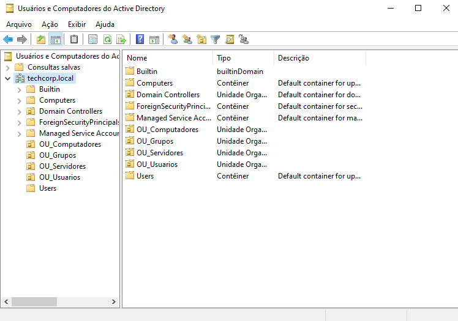

### 2. Estrutura de OUs e Objetos de Usuários
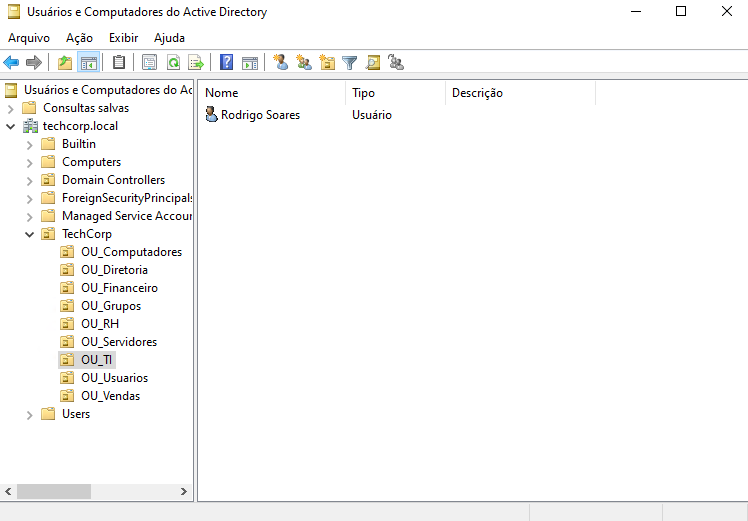

### 3. Editor de Gerenciamento de Diretiva de Grupo (GPO de Senha)

### 4. Ingresso do Cliente Windows 10 e Validação de GPO
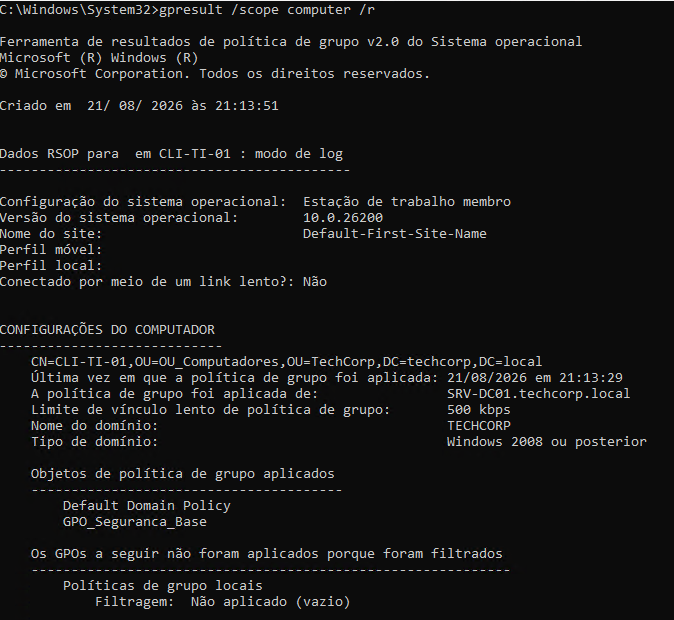

# Passo 03: Implementação de Serviços Essenciais de Rede (DHCP e DNS)

## 🎯 Objetivo
Configurar e validar a distribuição automática de endereçamento de rede via protocolo DHCP no Windows Server 2022, garantindo integração nativa com o Active Directory DS e resolução de nomes via DNS (Zonas Direta e Reversa).

---

## ⚙️ Especificações do Escopo DHCP (`Escopo_TechCorp_LAN`)
* **Rede/Sub-rede:** `192.168.10.0/24`
* **Intervalo de Distribuição:** `192.168.10.100` até `192.168.10.200`
* **Máscara de Sub-rede:** `255.255.255.0`
* **Gateway Padrão (Router):** `192.168.10.10`
* **Servidor DNS Principal:** `192.168.10.10` (`SRV-DC01`)
* **Nome do Domínio:** `techcorp.local`

---

## 🖼️ Evidências de Validação

### 1. Concessões Ativas no Console DHCP (`SRV-DC01`)
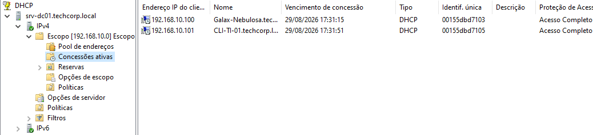

### 2. Endereço IP e Opções de Rede Recebidas no Cliente (`CLI-TI-01`)
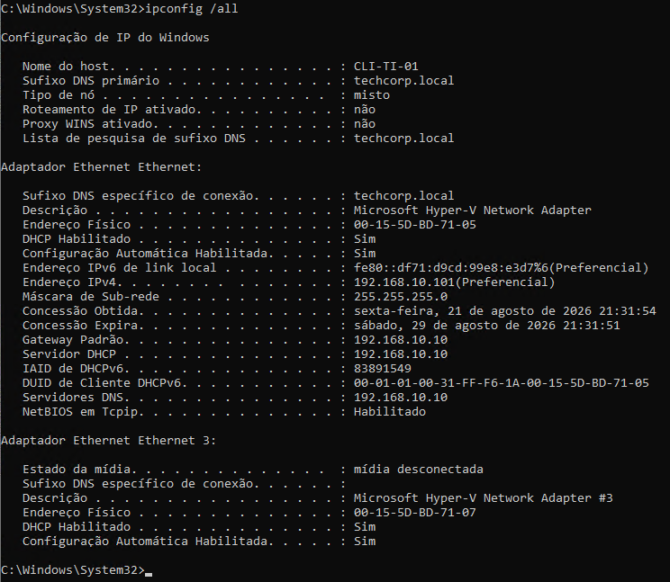

# Passo 04: Implementação de File Server com Permissões Compartilhadas e NTFS

## 🎯 Objetivo
Configurar um Servidor de Arquivos (File Server) corporativo no Windows Server 2022, implementando o princípio do menor privilégio (PoLP) através do controle de acesso baseado em funções (RBAC), combinando permissões de Compartilhamento SMB e Segurança NTFS.

---

## 📁 Estrutura de Pastas e Matriz de Acesso

| Pasta | Caminho Local | Grupo com Acesso | Nível de Permissão (NTFS) |
| :--- | :--- | :--- | :--- |
| `Empresa` | `C:\Empresa` | `Todos` (Everyone) | Read/List (Compartilhamento SMB) |
| `TI` | `C:\Empresa\TI` | `GRP_TI_Admins` | Controle Total |
| `Financeiro` | `C:\Empresa\Financeiro` | `GRP_Financeiro_RW` | Modificar / Leitura e Escrita |
| `RH` | `C:\Empresa\RH` | `GRP_RH_RW` | Modificar / Leitura e Escrita |
| `Vendas` | `C:\Empresa\Vendas` | `GRP_Vendas_RW` | Modificar / Leitura e Escrita |

---

## 🖼️ Evidências de Validação

### 1. Configuração de Permissões Avançadas NTFS (`SRV-DC01`)
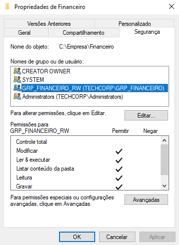

### 2. Validação de Controle de Acesso no Cliente (`CLI-TI-01`)
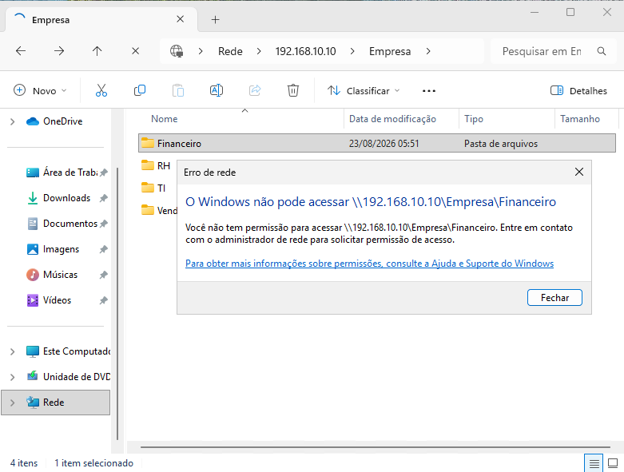

# Passo 05: Backup Corporativo e Retenção de Dados

## 🎯 Objetivo Geral
Garantir a continuidade de negócios e a proteção contra perda de dados no File Server corporativo, combinando recuperação instantânea via snapshots de volume (VSS) com rotinas automatizadas de backup incremental.

---

# 01. Proteção de Dados com Volume Shadow Copy (VSS)

## 🎯 Objetivo
Implementar e configurar o serviço de Cópias de Sombra (VSS - Volume Shadow Copy) nos volumes de armazenamento do File Server, permitindo a recuperação rápida de arquivos corrompidos ou deletados acidentalmente pelos próprios usuários (self-service recovery) sem necessidade de intervenção do N2/N3.

---

## 🛠️ Recursos Utilizados
* **Tecnologia:** Windows Server Volume Shadow Copy Service (VSS)
* **Recursos Implementados:**
  * Agendamento automático de snapshots diários do volume de dados.
  * Habilitação da aba "Versões Anteriores" no Explorador de Arquivos para os clientes da rede.
  * Mitigação de chamados N1 relacionados à perda acidental de documentos.

---

## 🖼️ Evidências de Execução

### 1. Habilitação e Agendamento do VSS no Volume
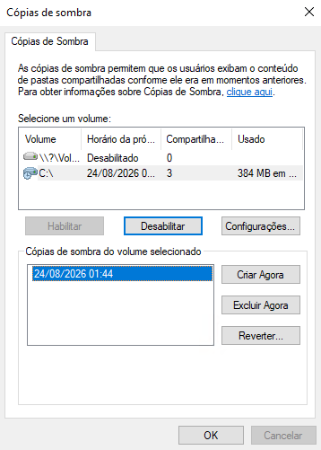

### 2. Validação da Restauração via Versões Anteriores
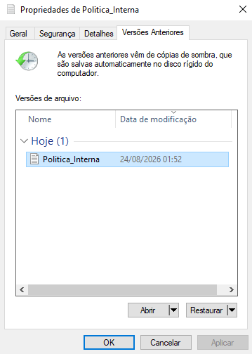

--- 

# 02. Rotina de Backup Corporativo Automatizado com Cobian Reflector

## 🎯 Objetivo
Configurar e automatizar rotinas de backup corporativo a nível de arquivos (File-Level) utilizando o **Cobian Reflector**, garantindo a redundância e integridade dos dados do File Server com agendamento periódico e estratégias de backup incremental.

---

## 🛠️ Recursos Utilizados
* **Ferramenta:** Cobian Reflector
* **Estratégia de Backup:** Backup Incremental da pasta crítica `C:\Empresa`
* **Recursos Implementados:**
  * Execução como Serviço do Windows (*Windows Service*) para operação em background.
  * Agendamento automatizado de rotinas diárias.
  * Separação rigorosa entre diretório de origem (Filesystem) e repositório de destino.

---

## 🖼️ Evidências de Execução

### 1. Configuração da Tarefa e Parâmetros de Backup
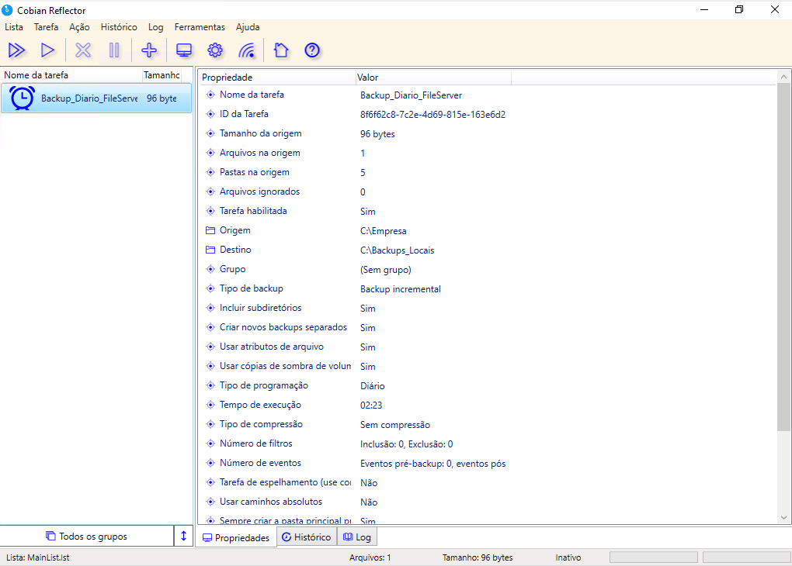

### 2. Validação dos Logs de Execução com Sucesso
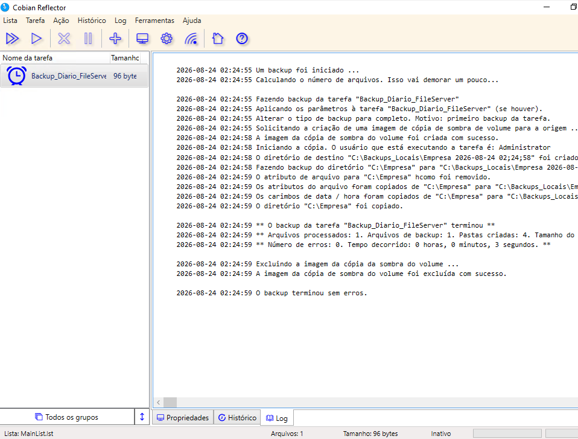

# Passo 06: Gestão de Impressão e Serviços de Rede

## 🎯 Objetivo Geral
Padronizar a gestão de dispositivos de impressão em ambiente corporativo, abrangendo o compartilhamento centralizado de recursos no servidor e a criação de automações para rápida resolução de incidentes de spooler travado.

# 01. Implantação de Servidor de Impressão e Compartilhamento de Redes

## 🎯 Objetivo
Configurar o compartilhamento centralizado de recursos de impressão no servidor de domínio (`SRV-DC01`), padronizando nomes de fila, permissões de acesso e publicação no diretório corporativo.

---

## 🛠️ Recursos Utilizados
* **Recurso:** Windows Server Print Management
* **Recursos Implementados:**
  * Criação de fila de impressão compartilhada (`IMP-RH-CORP`).
  * Atribuição de nomenclatura padronizada e localização física para inventário.
  * Restrição de permissões de gerenciamento de documentos via grupos de segurança.

---

## 🖼️ Evidência de Execução

### Impressora Compartilhada no Servidor
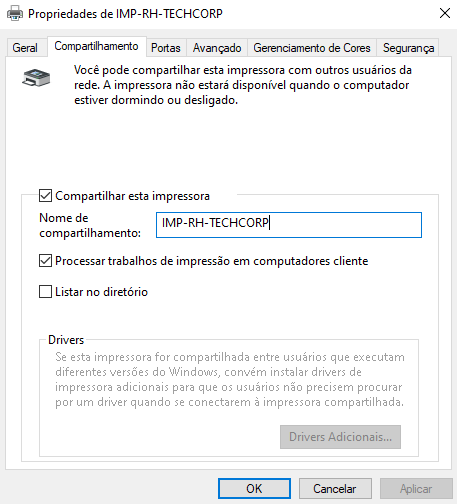

---
# 02. Automação de Manutenção do Spooler de Impressão

## 🎯 Objetivo
Desenvolver e aplicar script de manutenção preventiva/corretiva para a resolução de travamentos na fila de impressão do Windows, automatizando a interrupção do serviço, expurgo de arquivos temporários corrompidos e reinicialização limpa do Spooler.

---

## 🛠️ Recursos Utilizados
* **Tecnologia:** PowerShell (`Stop-Service`, `Remove-Item`, `Start-Service`)
* **Fluxo de Atuação N1:**
  * Interrupção forçada do serviço `Spooler`.
  * Limpeza de buffer no diretório `C:\Windows\System32\spool\PRINTERS`.
  * Restabelecimento do serviço e validação de status ativo.

---

## 🖼️ Evidência de Execução

### Execução do Script de Reset do Spooler
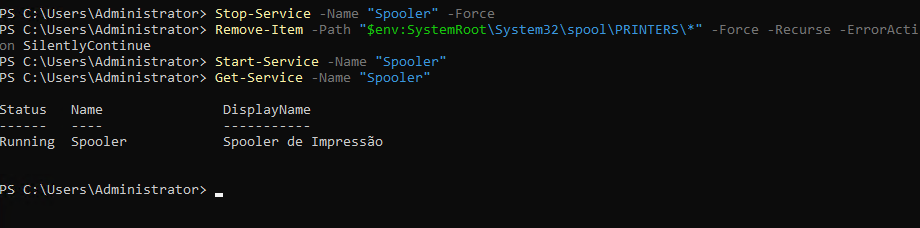
---
