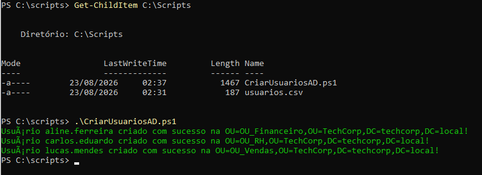
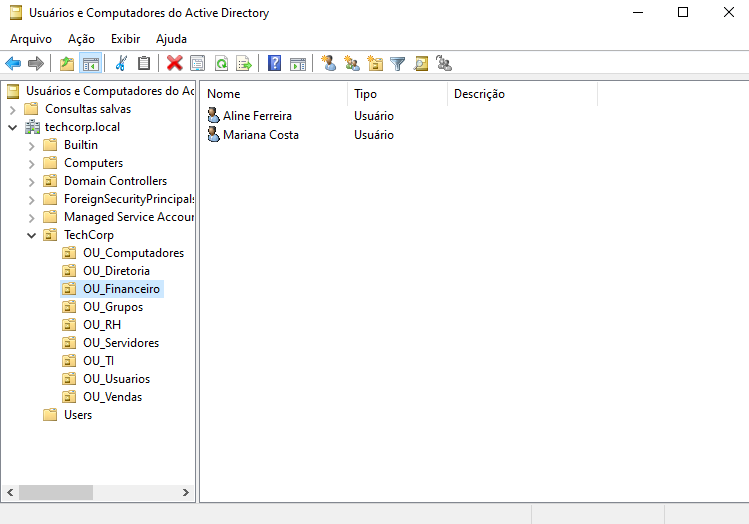

# Automação de Provisionamento no Active Directory via PowerShell

## 🎯 Objetivo
Automatizar a criação e o provisionamento em lote de usuários no Active Directory Domain Services (AD DS) utilizando um script em PowerShell e um arquivo de entrada de dados no formato CSV.

---

## 🛠️ Recursos Utilizados
* **Linguagem:** PowerShell 5.1 / Módulo ActiveDirectory
* **Fonte de Dados:** Arquivo `usuarios.csv` contendo Nome, Sobrenome, SamAccountName, Departamento e OU de destino.
* **Recursos Implementados:**
  * Tratamento de erros e verificação de duplicidade (`Get-ADUser`).
  * Criação automática do objeto de usuário na OU correspondente (`New-ADUser`).
  * Definição de senha padrão segura e solicitação de troca de senha no primeiro logon (`-ChangePasswordAtLogon $true`).

---

## 🖼️ Evidências de Validação

### 1. Execução do Script de Automação no PowerShell

### 2. Validação dos Objetos de Usuário Criados no Active Directory
