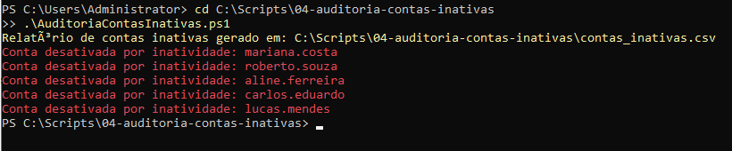

# Auditoria e Higiene de Segurança no AD (Contas Inativas)

## 🎯 Objetivo
Automatizar a varredura e o gerenciamento do ciclo de vida de contas no Active Directory, identificando usuários inativos há mais de 30 dias para exportação de relatórios em CSV e desativação preventiva das contas.

---

## 🛠️ Recursos Utilizados
* **Linguagem:** PowerShell 5.1 / Módulo ActiveDirectory
* **Cmdlets Chave:** `Get-ADUser`, `Disable-ADAccount`, `Export-Csv`
* **Recursos Implementados:**
  * Cálculo dinâmico de janela de tempo (`AddDays(-30)`).
  * Filtragem por propriedades estendidas de autenticação (`LastLogonDate`).
  * Geração automatizada de relatório CSV para auditoria.
  * Desativação automática em massa para redução de superfície de ataque.

---

## 🖼️ Evidência de Execução

### Varredura e Desativação Preventiva de Contas Inativas
