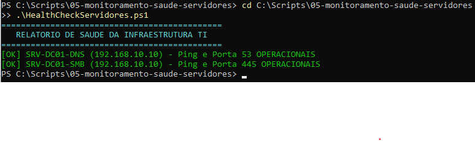

# 05. Monitoramento de Saúde da Infraestrutura (Health Check)

## 🎯 Objetivo
Desenvolver um script em PowerShell para auditoria rápida e validação contínua da saúde operacional dos servidores e serviços de rede vitais (DNS, SMB/File Server), realizando testes de conectividade ICMP e validação de portas TCP.

---

## 🛠️ Recursos Utilizados
* **Linguagem:** PowerShell 5.1
* **Cmdlets Chave:** `Test-Connection`, `Test-NetConnection`
* **Recursos Implementados:**
  * Teste de disponibilidade de camada de rede (Ping/ICMP).
  * Validação de portas de serviços críticos (Porta 53 para DNS, Porta 445 para SMB).
  * Tratamento visual de status (`[OK]` em verde, `[ALERTA]` em vermelho).

---

## 🖼️ Evidência de Execução

### Relatório de Validação de Serviços e Conectividade
