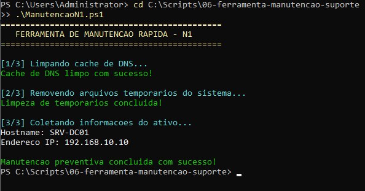

# 06. Ferramenta de Manutenção e Diagnóstico N1

## 🎯 Objetivo
Disponibilizar um script de execução rápida ("One-Click") para analistas de suporte N1 realizarem rotinas de manutenção preventiva/corretiva em estações e servidores, resolvendo problemas comuns de resolução de nomes, lentidão por arquivos temporários e identificação de ativos.

---

## 🛠️ Recursos Utilizados
* **Linguagem:** PowerShell 5.1
* **Cmdlets Chave:** `Clear-DnsClientCache`, `Remove-Item`, `Get-NetIPAddress`
* **Recursos Implementados:**
  * Purga automática de cache DNS local para correção de erros de rede.
  * Expurgador de arquivos temporários do sistema (`C:\Windows\Temp`).
  * Coleta rápida de inventário básico do ativo (Hostname e Endereço IP).

---

## 🖼️ Evidência de Execução

### Execução da Routine de Manutenção N1
