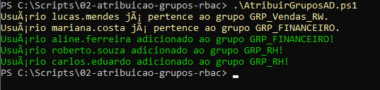

# 02. Atribuição Automatizada de Grupos de Segurança (RBAC) no AD

## 🎯 Objetivo
Automatizar o processo de adição de usuários aos seus respectivos grupos de segurança baseados em suas Unidades Organizacionais (RBAC - Role-Based Access Control) dentro do Active Directory, eliminando tarefas manuais de associação de perfis.

---

## 🛠️ Recursos Utilizados
* **Linguagem:** PowerShell 5.1 / Módulo ActiveDirectory
* **Cmdlets Chave:** `Get-ADUser`, `Get-ADGroupMember`, `Add-ADGroupMember`
* **Recursos Implementados:**
  * Mapeamento de OUs e grupos correspondentes (`Hashtable`).
  * Varredura dinâmica de usuários por Unidade Organizacional.
  * Verificação prévia de associação para evitar erros de duplicidade.

---

## 🖼️ Evidência de Execução

### Associação Automatizada de Grupos via PowerShell
