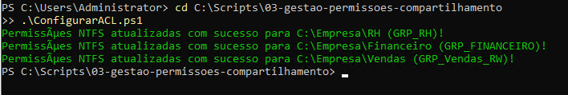

# 03. Gestão Automatizada de Permissões de Compartilhamento (ACL/NTFS)

## 🎯 Objetivo
Automatizar a criação de diretórios de departamentos e a aplicação de Listas de Controle de Acesso (ACLs/NTFS) com herança configurada, garantindo que cada grupo RBAC tenha exatamente as permissões necessárias nos seus respectivos diretórios de rede.

---

## 🛠️ Recursos Utilizados
* **Linguagem:** PowerShell 5.1
* **Cmdlets Chave:** `Get-Acl`, `Set-Acl`, `New-Object System.Security.AccessControl.FileSystemAccessRule`
* **Recursos Implementados:**
  * Criação condicional de estrutura de diretórios (`Test-Path`).
  * Concessão dinâmica de permissão de Modificação (`Modify`) com herança para subpastas e arquivos (`ContainerInherit, ObjectInherit`).
  * Padronização de acesso por grupos do Active Directory.

---

## 🖼️ Evidência de Execução

### Aplicação de Regras de Acesso NTFS via PowerShell
